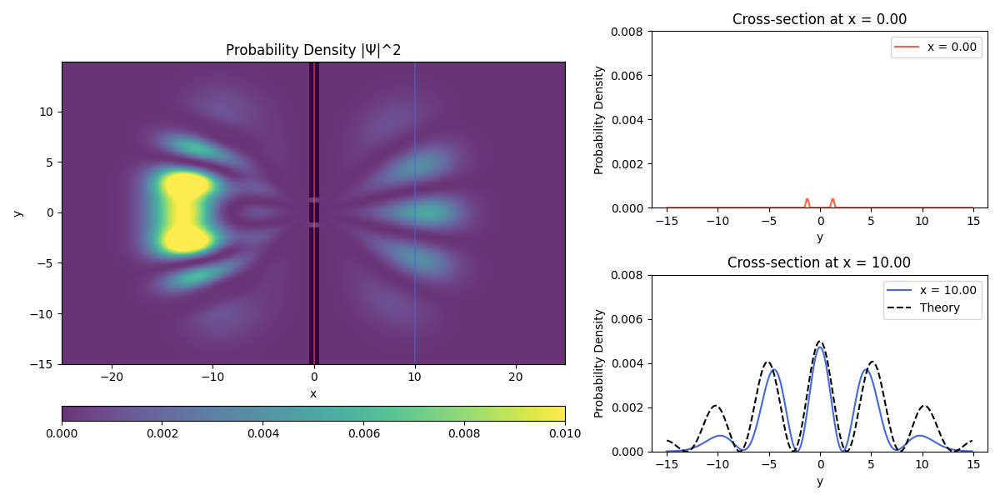

This README is generated by ChatGPT.  

# Double Slit Quantum Simulation 

  

---

## Overview (概要)

In this project, we provide code for simulating and visualizing a double-slit quantum experiment.  
このプロジェクトでは、二重スリットの量子シミュレーションとそれを可視化するコードを提供します。

We solve the following two-dimensional Schrödinger equation with the finite-difference method and a 4th-order Runge–Kutta (RK4) approach:  
次のような2次元のシュレディンガー方程式を有限差分法と4次のルンゲ＝クッタ法(RK4)で解いています。

$$ i \frac{\partial \Psi}{\partial t} = -\frac{1}{2} \nabla^2 \Psi + V \Psi $$

For the numerical computation, we use Fortran, while Python manages the execution and visualization.  
数値計算の部分にはFortranを用い、その実行と可視化ではPythonを利用しています。

---

## Features (特徴)

- **Fortran Code (qm.f90)**  
  This Fortran code numerically solves the 2D Schrödinger equation using a 4th-order Runge–Kutta (RK4) method for time evolution.  
  2次元シュレディンガー方程式を数値的に解くFortranコードです。ルンゲ＝クッタ法(RK4)により時間発展を行います。

- **Python Wrapper (QMLib.py)**  
  Provides a convenient interface (via `ctypes`) to call the Fortran routines from Python.  
  Python側でFortranのサブルーチンを呼び出すための`ctypes`ラッパーを提供します。

- **Simulation Scripts**  
  
  - **double_slit_simulation.py**  
    This script calculates probability densities, displays cross-sections of the wavefunction, and compares the results to Fraunhofer diffraction theory.  
    確率密度や、波動関数の断面表示、フラウンホーファー回折の理論との比較を行うスクリプトです.

  - **simplified_double_slit_simulation.py**  
    A simpler script that only runs a 2D heatmap animation of the probability density.  
    確率密度の2次元ヒートマップによるアニメーションを実行するだけのシンプルなコードです。

---

## Requirements (必要環境)

- A Fortran compiler (e.g., gfortran)  
  Fortranコンパイラ（例：gfortran）

- Python 3.x  
  - numpy  
  - matplotlib  
  - tqdm 

- Linux or macOS recommended (Windows requires WSL or an appropriate Fortran setup)  
  LinuxまたはmacOS推奨（WindowsではWSLなどでFortran環境を構築すれば動作可能）

---

## Setup Instructions (セットアップ手順)

1. **Build the Fortran Library**  
   Go to the `lib` directory and compile the Fortran code to produce the shared library `libfort.so`.  
   `lib`ディレクトリへ移動し、Fortranコードをコンパイルして共有ライブラリ`libfort.so`を生成します。

   ```
   cd lib
   ./compile.sh
   ```

   Or run a similar command manually:  
   または、次のように手動でコンパイルしてください。

   ```
   gfortran -shared -fPIC qm.f90 -o libfort.so
   ```

2. **Install Python Dependencies**  
   Pythonの依存関係をインストールします。

   ```
   pip install numpy matplotlib tqdm
   ```

3. **Run the Simulation**  
   シミュレーションを実行します。

   - For a full-featured visualization:  
     詳細な可視化の場合:

     ```
     python double_slit_simulation.py
     ```

   - For a simpler animation:  
     シンプルなアニメーションの場合:

     ```
     python simplified_double_slit_simulation.py
     ```

---

## License  
ライセンス

This project is released under the [MIT License](https://opensource.org/licenses/MIT).  
本プロジェクトは[MIT License](https://opensource.org/licenses/MIT)のもとで公開されています。

Feel free to use or modify the code for your own purposes.  
自由に利用・改変いただけます。
